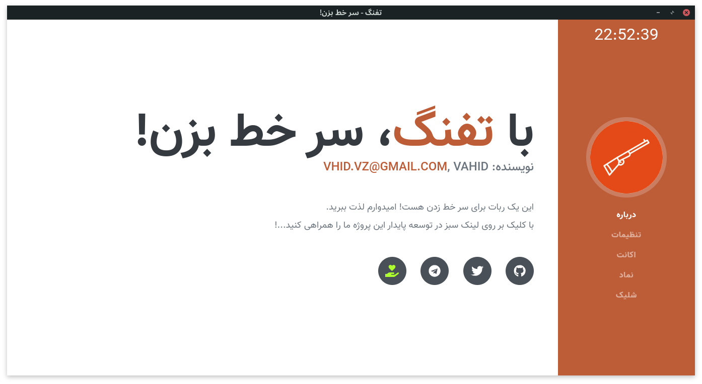
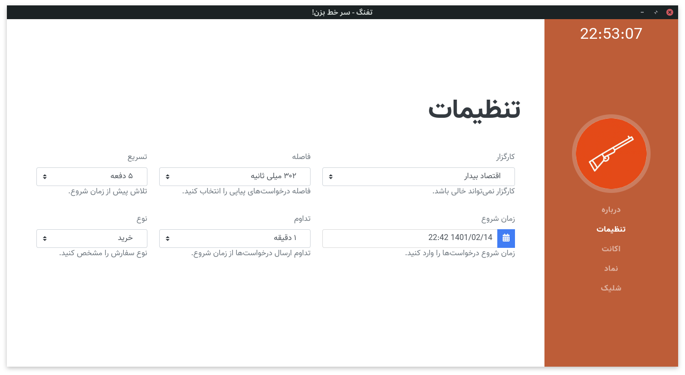
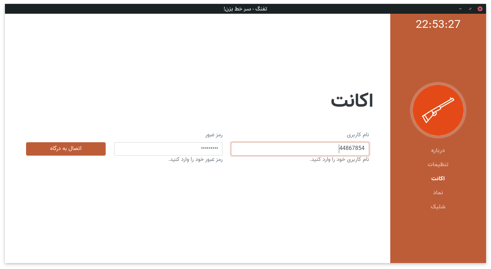
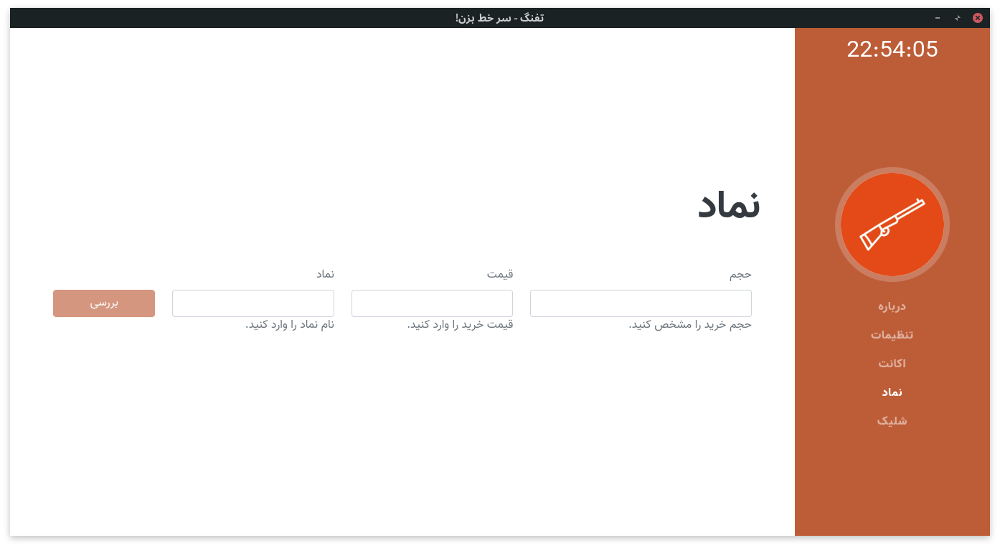
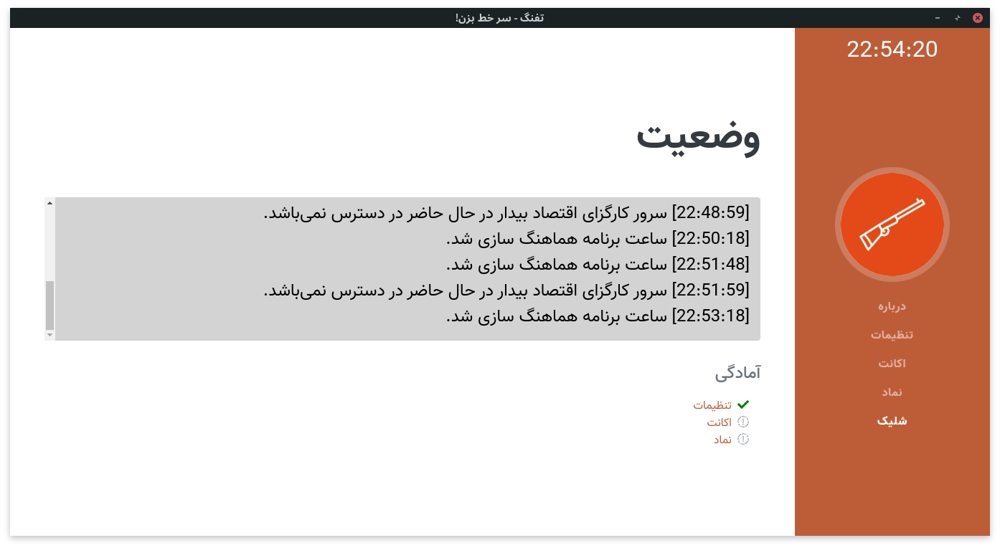

# Shotgun Buyer

ربات سر خط زنی بورس ایران

ویژگی‌ها:

- تنظیم دقیق ساعت با Network Time Protocol (NTP)
- محاسبه زمان پینگ و در نظر گرفتن زمان ارسال به کارگزاری
- تنظیمات پیشرفته و قابلیت اتصال هر نوع کارگزاری به نرم افزار

## Screen Shots







## Start Guide

Clone this repository whit [Git](https://git-scm.com) then, install [NodeJS](https://nodejs.org/en/download/) (which has [npm](http://npmjs.com)), you should install prerequisites after NodeJS by command `npm i -g pnpm npm-check-updates` with admin or root privilege. also, you need to install the latest version of google chrome.

```bash
# Clone this repository
git clone https://github.com/vhidvz/shotgun-buyer
# Go into the repository
cd shotgun-buyer
# update package.json deps
ncu -u
# Install dependencies
pnpm install
# Run the app
pnpm start
```
